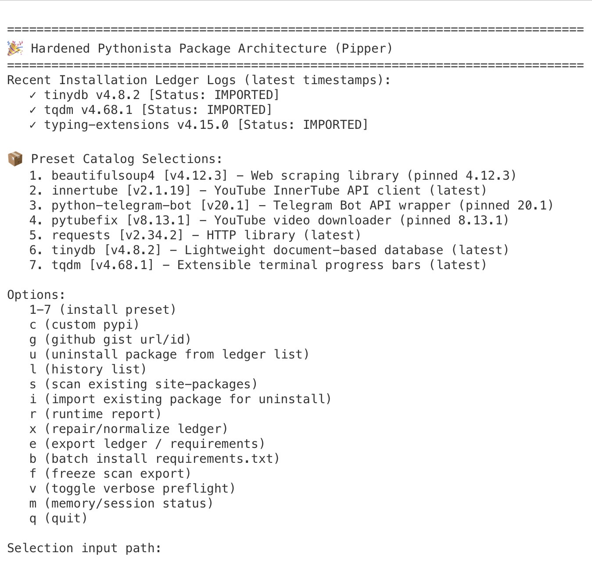

## Pipper

Hardened Package Manager, Pip Bootstrap Utility, and Recovery Tool for Pythonista (iOS)

Pipper is a security-focused package manager designed specifically for Pythonista’s unique iOS environment.

It provides:

* PyPI package installation
* GitHub Gist package installation
* Automatic pip bootstrap and recovery
* Manifest-based uninstall support
* Package export and freeze tools
* Installation history and recovery utilities
* Security hardening for archives and remote content

Pipper was built specifically for Pythonista’s limitations, where traditional desktop package management workflows often fail.

## Screenshot

Why Use Pipper Instead of Raw pip?

Pipper adds functionality that standard pip does not provide inside Pythonista:

* Pip bootstrap and recovery
* Safer archive handling
* Installation tracking
* Manifest-based uninstall
* GitHub Gist package installation
* Export and freeze tools
* Package import from existing site-packages
* Pythonista compatibility checks
* Session diagnostics and memory monitoring
* Ledger repair and recovery tools

⸻

Why Pipper Exists

Pythonista runs entirely inside iOS and does not support subprocess execution.

Because of this:

* Many desktop pip workflows fail
* Source distributions frequently fail
* Packages requiring compilation cannot be built
* Traditional uninstall methods are unreliable
* Pip may be missing or accidentally removed

Pipper provides a safer, more reliable package management workflow designed around these platform limitations.

⸻

Built-In Pip Bootstrap

Many Pythonista users discover that:

* pip is missing
* pip is broken
* pip was accidentally deleted
* package installation no longer works

Pipper can automatically bootstrap a compatible pip installation when required.

Features:

* Detects missing pip
* Downloads a verified bootstrap wheel
* Installs pip into Pythonista’s site-packages directory
* Allows package installation without requiring StaSh
* Works entirely in-process
* Requires no subprocess support

For many users, Pipper acts as both:

1. A pip recovery utility
2. A full package manager

⸻

Features

Package Installation

* Install packages directly from PyPI
* Install packages from GitHub Gists
* Preset package catalog
* Optional dependency installation prompts
* Batch installation from requirements.txt
* Compatibility preflight checks
* Existing package import support

Package Management

* Manifest-based uninstall system
* Package discovery and scanning
* Installation ledger tracking
* Freeze installed packages into requirements.txt
* Export package inventories and backups
* Runtime diagnostics
* Session memory tools
* Ledger repair and normalization

Security

Built-in protections include:

* Zip-Slip protection
* Path traversal protection
* Symlink blocking
* Compression bomb detection
* Archive entry count limits
* Download size limits
* Strict Gist filename validation
* GitHub raw-content allow-listing
* Atomic file operations
* Manifest ownership tracking

Reliability

* Atomic ledger updates
* Corruption recovery with backups
* Network retry handling
* Graceful degradation when optional libraries are unavailable
* Built-in self-tests
* Session diagnostics and cleanup tools

⸻

Supported Sources

PyPI

Install packages directly from PyPI using Pythonista-compatible workflows.

GitHub Gists

Install and manage packages distributed through GitHub Gists.

Before processing remote content, Pipper:

* Validates filenames
* Validates download sources
* Validates archive contents
* Requests user confirmation

⸻

Menu Options

Option	Description
Presets	Install common packages
c	Custom PyPI install
g	Install from GitHub Gist
u	Uninstall package
b	Batch install from requirements.txt
s	Scan installed packages
i	Import existing package into ledger
l	View installation history
f	Freeze installed packages
e	Export ledger and requirements
m	Memory and session tools
r	Runtime report
x	Repair and normalize ledger
v	Toggle verbose compatibility preflight
q	Quit

⸻

Important Pythonista Notes

Close the Pipper Script Before Leaving Pythonista

For best stability:

1. Run Pipper.
2. Complete package operations.
3. Exit Pipper.
4. Close the Pipper script tab/window.
5. Then leave Pythonista.

Leaving Pythonista while the Pipper script window remains open may cause Pythonista to become unstable when reopening on some devices.

This appears to be related to Pythonista’s session restoration behavior and in-process package management rather than installed packages themselves.

⸻

Troubleshooting

Pythonista Crashes When Reopening

In some situations, leaving Pythonista while the Pipper script window remains open can cause Pythonista to crash repeatedly when reopening.

Recovery Procedure

1. Open the iOS Settings app.
2. Scroll down and select Pythonista.
3. Enable Launch in Safe Mode.
4. Launch Pythonista.

Safe Mode prevents Pythonista from restoring previously running scripts and usually allows recovery.

⸻

Package Installation Fails

Some packages cannot be installed on Pythonista because of iOS restrictions.

Common causes include:

* Source distributions (sdist)
* Packages requiring compilation
* Packages requiring setup.py builds
* Packages requiring subprocess execution
* Packages requiring build isolation

Wheel-based packages generally provide the best experience.

⸻

Pip Appears Frozen

Large downloads may take time.

Pipper displays live pip output during installations. If output is still being produced, allow the operation to complete before interrupting it.

⸻

Ledger Repair

If the installation ledger becomes corrupted:

1. Launch Pipper.
2. Select x (repair/normalize ledger).
3. Pipper will automatically create a backup before repairs.

⸻

Session Memory Management

Because pip runs entirely in-process, repeated installs and removals can increase memory usage during a single Pythonista session.

Pipper includes session monitoring tools to help identify long-running sessions.

If you perform many package operations:

1. Exit Pipper.
2. Close the Pipper script window.
3. Restart Pythonista if necessary.

This helps ensure a clean environment and avoids memory pressure from repeated in-process pip usage.

⸻

Export and Backup

Pipper can export:

* Installation ledger
* requirements.txt
* Human-readable package summaries
* Freeze snapshots of installed packages

Exports are written to:

Documents/pipper_exports/

This makes it easy to:

* Back up your environment
* Migrate between devices
* Recreate installations later

⸻

Self Tests

Pipper includes an internal self-test suite covering:

* Package identity handling
* Path safety validation
* Requirements parsing
* GitHub Gist URL and ID parsing
* GitHub Gist filename validation
* RECORD path safety

These tests help verify script integrity after modifications.

⸻

Security Philosophy

Pipper follows a simple principle:

Never trust archives, metadata, paths, filenames, or remote content until they have been validated.

The project prioritizes:

* Safety
* Transparency
* Recoverability
* Pythonista compatibility

over convenience.

⸻

Keywords

Pythonista

iOS Python

pip installer

pip bootstrap

Pythonista package manager

Pythonista pip

StaSh alternative

iPad Python

Python package installer

GitHub Gist installer

⸻

Version

Pipper v1.0.1

Production release for Pythonista.

⸻

License

MIT License

⸻

Disclaimer

Use at your own risk.

While extensive effort has been made to improve safety and reliability, no package manager can guarantee compatibility with every package, dependency tree, or future Pythonista release.

Always keep backups of important scripts and data.
